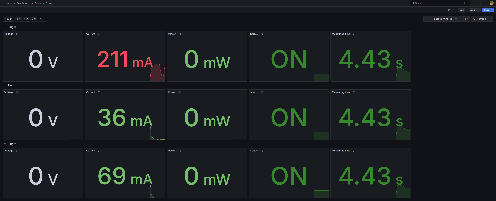

# What is SPEAR

**SPEAR** is a project designed to provide a low-cost, smart Power Distribution Unit (PDU) based on Arduino and
Raspberry Pi Zero, primarily intended for homelab environments.

The goal is to **measure power consumption** and **control power to individual plugs**, both via physical switches and a
web API.

Power metrics are exposed via a **Prometheus-compatible endpoint**, allowing for easy collection and visualization using
**Prometheus** and **Grafana**.

The project is designed to be **stateless**. Prometheus and Grafana are expected to be hosted externally to enable
centralized monitoring environments.

---

# ⚠️ Disclaimer

This project involves working with **high-voltage electricity (110/240V)**, which can cause serious damage to equipment,
electrical systems, or even result in personal injury or death.

**Use this project at your own risk.** You assume full responsibility for any damage or injury.  
The author assumes no liability for any harm resulting from the use of this project.

---

# 🛠 Roadmap

### 🔌 Power Measurement via Arduino

- [x] Measure current
- [x] Measure voltage
- [ ] Calculate power
- [ ] Calibrate specific sensors

### 🌐 Web Service

- [x] Read power data from Arduino
- [x] Expose Prometheus-compatible endpoint
- [ ] Implement basic authentication for all services
- [x] Load configuration from file

### ⚙️ Plug Control

- [ ] Control plugs via physical switch
- [ ] Control plugs via API
- [ ] Read actual plug state
- [ ] Control status LED for switches

### 🔌 UPS measurement reading
- [ ] Read UPS values from NUT
- [ ] Expose UPS Values as metrics

### 🧪 Testing Environment

- [x] Launch Prometheus and Grafana via Docker Compose (for local testing)
- [x] Automatically configure Prometheus to scrape local instance
- [x] Automatically configure Grafana to connect to local Prometheus
- [x] Generate random values to simulate data without Arduino

### 📊 Other

- [ ] Provide ready-to-use Grafana dashboards
- [ ] Pack the entire project into a **deb** package for easy installation on Raspberry Pi OS

---

# Usage

The project ships a makefile which can cover the most common cases. From project root run one of the following commands

- `make run`: run server exposed on port 8000
- `make test`: run unit test with coverage
- `make clean`: delete temporary files
- `make lint`: automatically fix linting
- `make docker-up`: spawn prometheus and grafana containers with default dashboard and datasource
- `make docker-down`: tear down prometheus and grafana containers

---

# 📊 Dashboards

The project provides also some pre-built dashboards which can be imported in an existing grafana instance.

The docker compose environment automatically spawns with imported dashboards and configured datasource as as demo or
development environment.

